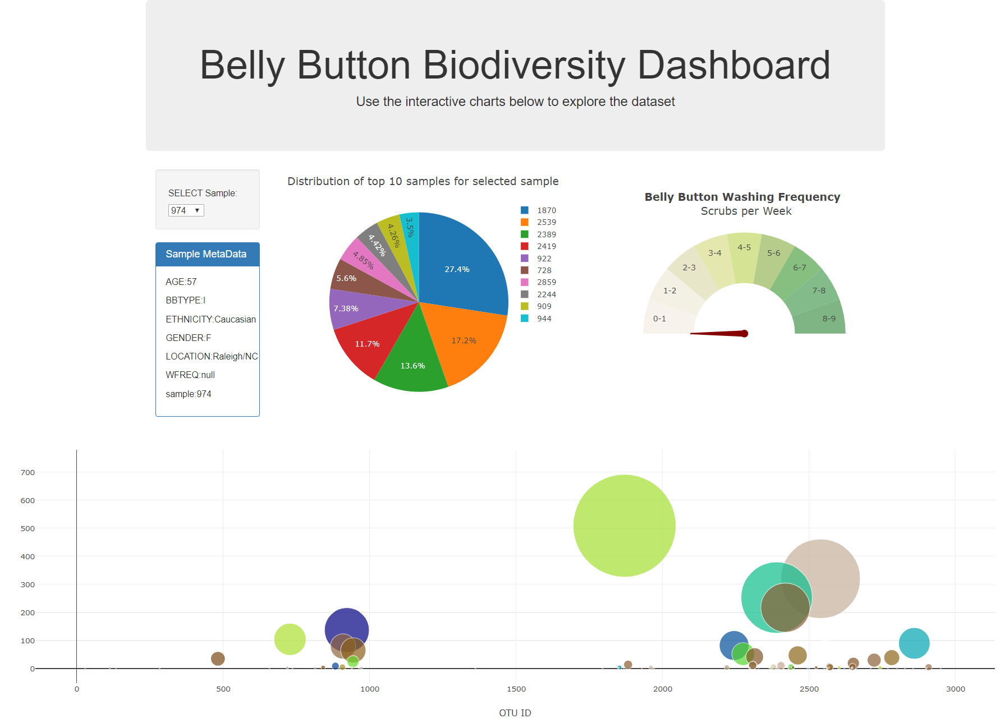

# Belly Button Biodiversity Analysis (Python+Flask+Plotly.js+HTML+Heroku)

**Background:**
The belly button is one of the habitats closest to us, and yet it remains relatively unexplored. In January 2011, Belly Button Biodiversity to investigate the microbes inhabiting our navels and the factors that might influence the microscopic life calling this protected, moist patch of skin home was launched.
[Belly Button Biodiversity DataSet](http://robdunnlab.com/projects/belly-button-biodiversity/)

**Objective:**
Create an interactive dashboard to explore the amazing diversity of cultured bacteria from the participant's belly buttons!

**Live link:**
[App - Live Link](https://analytics-belly-btn-diversity.herokuapp.com/)

**Solution / Approach**
* Use sqlite file for the database.
* Used Flask API starter code to serve the data needed for the plots
* Created a PIE chart to display the top 10 samples
* Created a Bubble Chart to display each sample
* Update the chart whenever a new sample is selected
* Adapted the Gauge Chart from <https://plot.ly/javascript/gauge-charts/> to plot the Weekly Washing Frequency
* Deployed the Flask app to Heroku

# Technology / Framework
* Python
* Flask API
* SQLite database
* HTML/CSS/JavaScript
* Plotly.js - To build interactive charts for the dashboard

# Screenshot of the webpage built
 
