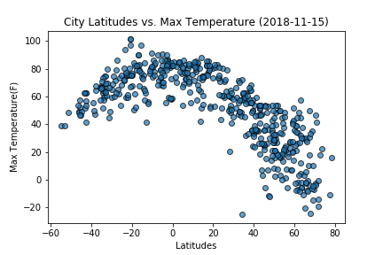
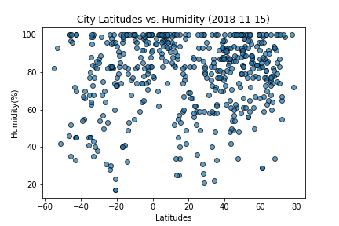
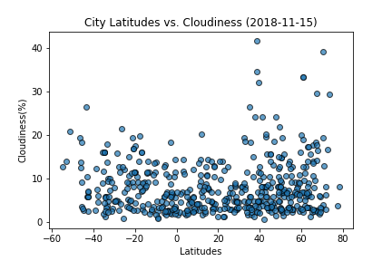
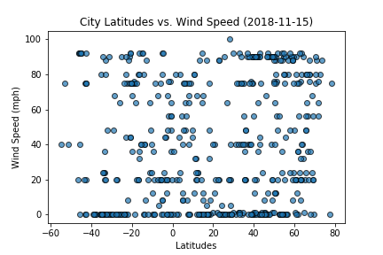

# Weather Data Analysis (Python+API+Matplotlib)

This project uses Python, Python libraries, and the OpenWeatherMap API to visualize the weather of 500+ random cities across the world with varying distance from the equator

**Objective:**
"What's the weather like as we approach the equator?"

**Solution / Approach**
* Randomly selected 500+ unique (non-repeat) cities based on latitude and longitude.
* Performed a weather check on each of the cities using a series of successive API calls.
* Saved both a CSV of all data retrieved and png images for each scatter plot.
* Build a series of scatter plots to showcase the following relationships:
	* Temperature (F) vs. Latitude
	* Humidity (%) vs. Latitude
	* Cloudiness (%) vs. Latitude
	* Wind Speed (mph) vs. Latitude

**Technologies/Framework Used:**
* Python
* Pandas 
* Matplotlib
* Citipy
* Numpy
* Requests for connecting to API & JSON Traversals

### Analysis / Observable trends 
* Cities closer to the equator (latitude 0) have higher temperature when compared to cities away from equator (i.e. latitude close to -90 and latitude close to +90)
* Majority of the cities in the random sample of 501 cities have humidity levels of 60% and higher
* Majority of the cities in the random sample of 501 cities have cloudiness levels of 15% or lower
* Wind speeds for cities in the random sample of 501 cities are quite evenly distributed with a noticeable number of cities not having wind speed data (These cities were still considered in the sample size as they had all the other data points needed for plotting

#### Latitude vs. Max Temperature

#### Latitude vs. Humidity

#### Latitude vs. Cloudiness

#### Latitude vs. Wind Speed

