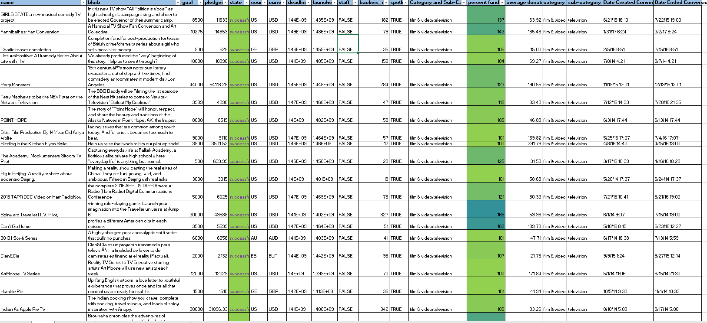
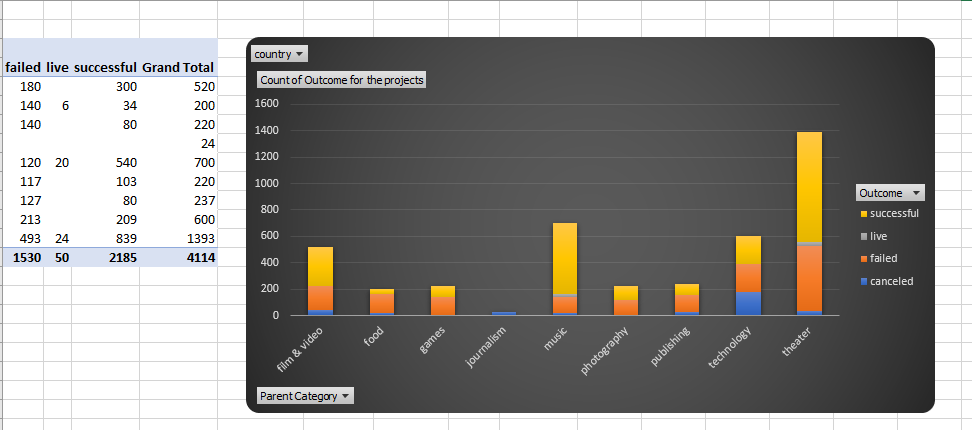
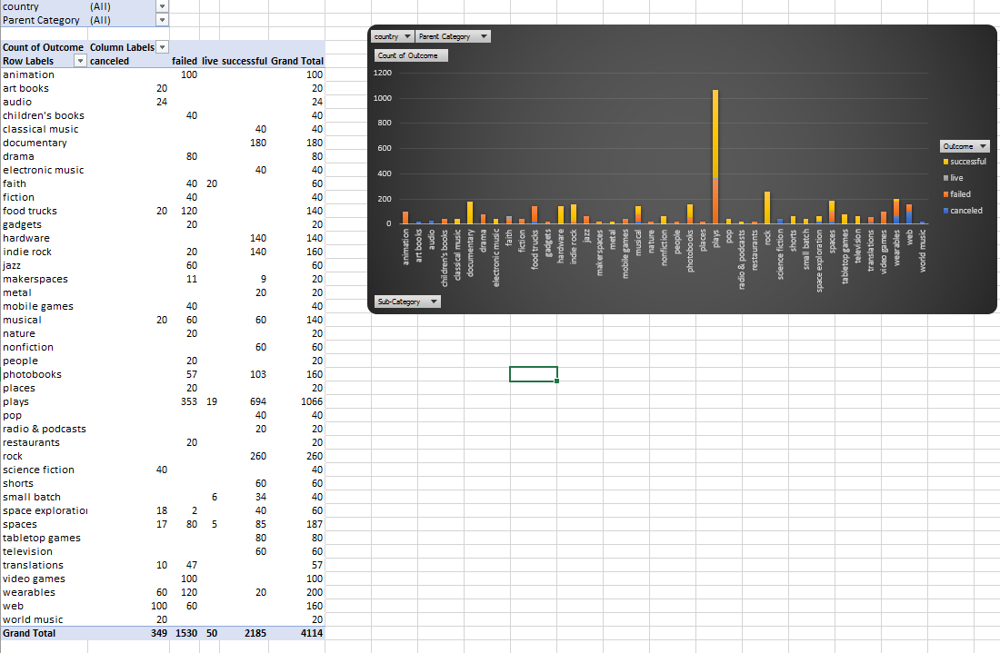
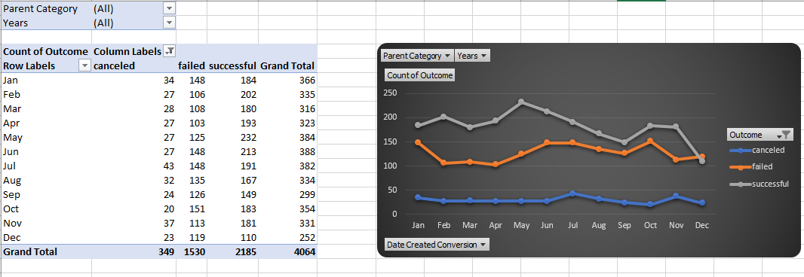
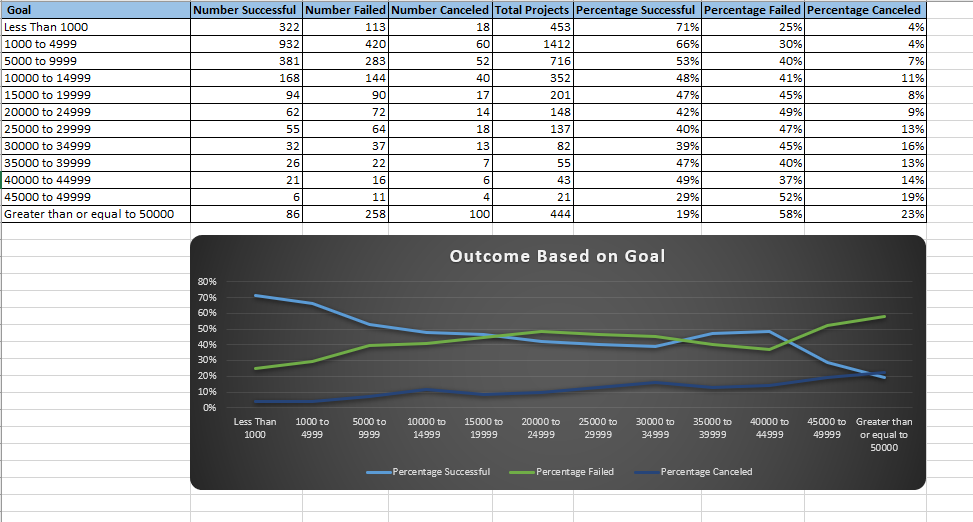

# Kickstarter Data Analysis (Adv Excel)

**Background:**
Over two billion dollars have been raised using the massively successful crowdfunding service, Kickstarter, but not every project has found success. Of the over 300,000 projects launched on Kickstarter, only a third have made it through the funding process with a positive outcome. Since getting funded on Kickstarter requires meeting or exceeding the project's initial goal, many organizations spend months looking through past projects in an attempt to discover some trick to finding success. 

**Objective:**
Organize and analyze a database of four thousand past projects in order to uncover any hidden trends.

**Solution / Approach**

* Used conditional formatting to fill each cell in the `state` column with a different color, depending on whether the associated campaign was "successful," "failed," "cancelled," or is currently "live".
* Created a new column at column `percent funded` that uses a formula to uncover how much money a campaign made towards reaching its initial goal.
	* Use conditional formatting to fill each cell in the `percent funded` column using a three-color scale. The scale should start at 0 and be a dark shade of red, transitioning to green at 100, and then moving towards blue at 200.
* Create a new column at column `average donation` that uses a formula to uncover how much each backer for the project paid on average.
* Created two new columns, `category` and `sub-category`, which use formulas to split the `Category and Sub-Category` column into two parts.

* Created a new sheet with a pivot table that will analyze the initial worksheet to count how many campaigns were "successful," "failed," "cancelled," or are currently "live" per **category**.
    * Create a stacked column pivot chart that can be filtered by `country` based on the table was created.
	

* Created a new sheet with a pivot table that will analyze the initial sheet to count how many campaigns were "successful," "failed," "cancelled," or are currently "live" per **sub-category**.
    * Create a stacked column pivot chart that can be filtered by `country` and `parent-category` based on the table that was created.
* The dates stored within the `deadline` and `launched_at` columns are using UNIX timestamps which was converted into a normal date.
* Created a new column `Date Created Conversion` that converts the data contained within `launched_at` into Excel's Date format
* Created a new column `Date Ended Conversion` that converts the data contained within `deadline` into Excel's Date format

* Created a new sheet with a pivot table with a column of `state`, rows of `Date Created Conversion`, values based on the count of `state`, and filters based on `parent category` and `Years`.
* Created a pivot chart line graph that visualizes this new table.

* Created a new sheet with 8 columns: `Goal`, `Number Successful`, `Number Failed`, `Number Canceled`, `Total Projects`, `Percentage Successful`, `Percentage Failed`, and `Percentage Canceled`
  * In the `goal` column, created twelve rows with the following headers...
    * Less Than 1000
    * 1000 to 4999
    * 5000 to 9999
    * 10000 to 14999
    * 15000 to 19999
    * 20000 to 24999
    * 25000 to 29999
    * 30000 to 34999
    * 35000 to 39999
    * 40000 to 44999
    * 45000 to 49999
    * Greater than or equal to 50000

* Used the `COUNTIFS()` formula, count how many successful, failed, and canceled projects were created with goals within those ranges listed above. Populate the `Number Successful`, `Number Failed`, and `Number Canceled` columns with this data.
* Added up each of the values in the `Number Successful`, `Number Failed`, and `Number Canceled` columns to populate the `Total Projects` column. Then, used a mathematic formula, find the percentage of projects which were successful, failed, or were canceled per goal range.
* Created a line chart which graphs the relationship between a goal's amount and it's chances at success, failure, or cancellation.
  
# Technology / Framework
* Adv Excel Features

# Analysis / Observable trends 
* A couple of conclusions we can make about the Kickstarter campaign given the provided data are:
	* Categories like file & video, music and theaters have more than a 50% success rate whereas other categories like journalism and food have less than 25% success rate. Breaking this up into sub-categories, we can observe that sub-categories like documentary, hardware, indie rock, rock & tabletop games have an extremely high success rate whereas others like animation, food trucks, video games, jazz, and drama have an extremely high failure rate 
	* The success rate is higher for projects having a lower Kickstarter goal e.g. projects with a goal of less than $10,000 has a success rate of 71% whereas projects with a goal of >=$50,000 have a success rate of 19%
	* The average cancelation rate for projects having a goal of greater than or equal to $25,000 is more than 2 times of those having a goal of less than $25,000 e.g. projects with a goal of >=$25,000 have an average cancelation rate of 16.3% whereas projects with goal of less than $25,000 have an average cancelation rate of 7.2%
	* Project with creation date in the first half of the year (Jan – July) seems to have a higher success rate that projects with creation date in the second half of the year (Aug - Dec)  

* Some of the limitations of the dataset are
	* Although we are able to calculate the average contribution based on the pledged amount and no of backers, we don’t have clarity on how much was contributed by each backer. This is important is 90% of contribution can come from one user or it could be more evenly distributed. This gives us an insight into the weightage for the backing
	* We don’t have details on why a project was canceled and we also don’t have the date of cancelation. If projects were canceled closer to the deadline as they are not able to raise the goal amount, technically they are failed projects and not canceled. Also, insight into the reason for cancelation can give a lot of valuable information
	* The data has a launched date and deadline date but does not indicate what date the project reached its goal. Having this data can help in identifying the time it took for the project to reach it’s goal and we can view this information at a country, category or sub-category level and identify useful patterns
	* No clarity on how some data is being set. e.g. spotlight value seems to be true only for successful projects but its not clear if that is the only factor that affects the spotlight

* Other possible tables/graphs that we could create are
	* A graph to view the relation between % of projects that met the goal (i.e. successful) vs. country to see if projects in a certain country become more successful than others
	* A graph to view the relation between projects picked by staff (Staff picked as True) vs. the ones that were not picked by staff and see how effective the staff was in picking projects that became a success
	* A graph to view the goal of a project vs. the number of backers for successful projects to see projects with larger goals just had more backers or if they had a similar number of backers as that of a smaller goal project but had larger average contribution per backer. 
	* A graph to view the impact of the popularity of a project based on the number of backers vs. success/failure of the projects to see how popularity impacts its success  
	* A graph to view no of backers and their average contribution for successful projects to see if it were few people that contributed most of the money for successful projects or many people that contributed smaller amounts  to result in the success of a project

